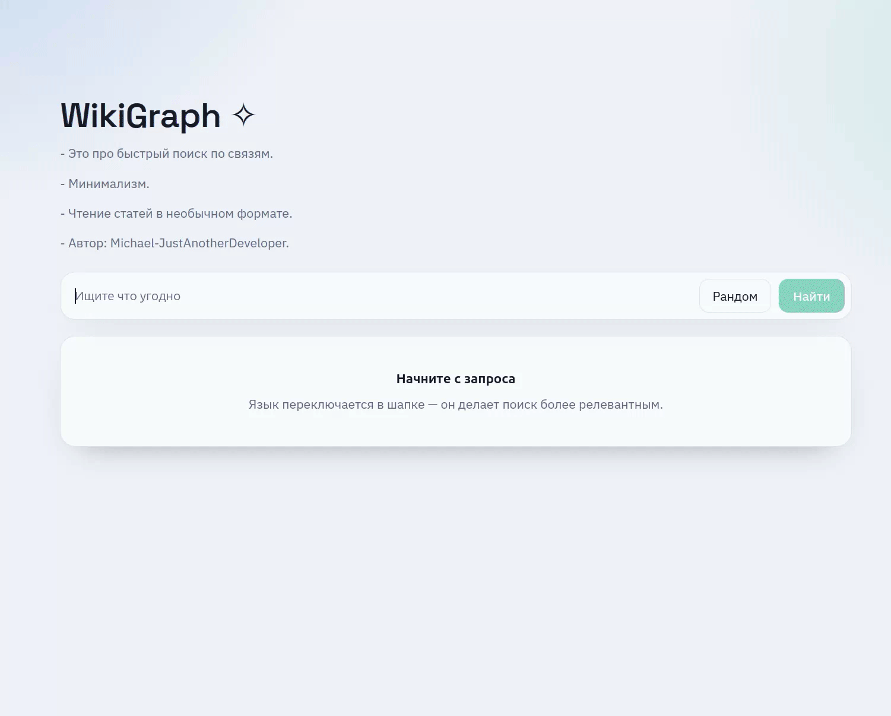
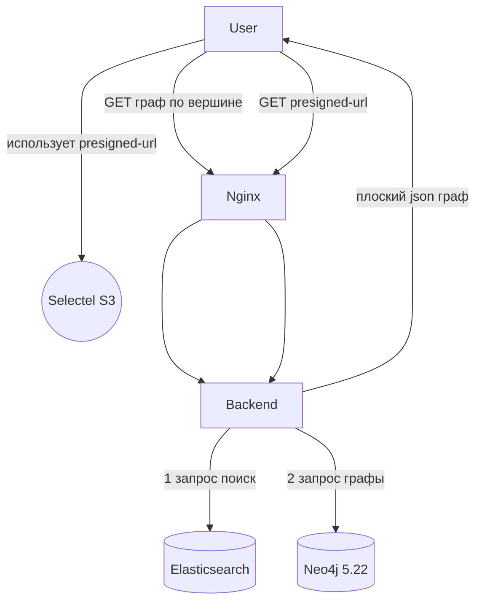
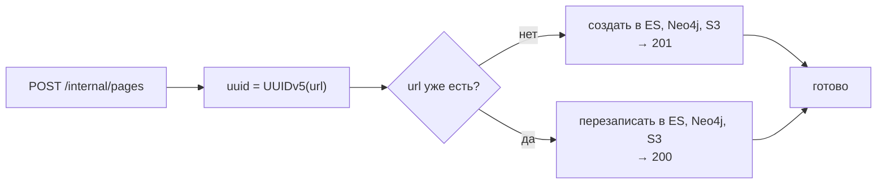

# WikiGraph  (demo)




Пользователь ищет статьи через граф связей, кликает по вершине и открывает HTML-страницу из объектного хранилища.

Поиск через Elasticsearch, граф — в
Neo4j, HTML-контент — в S3. Все три хранилища связаны через `uuid`,
детерминированный от `url`.

`URL` может не быть формата `/example/page1` но так писать рекомендуется.

- можно использовать этот проект как основу для своей версии "WikiGraph" и построения своей базы знаний
- удобная миграция данных (Понятный пример через админку)
- базово покрыт тестами, выстроен CI процесс, то есть инфраструктура в процессе развития

## Запуск
в .env.example файле прописана тестовая рабочая конфигурация, но большинство S3 параметров - нерабочие заглушки, свой бакет вы сами должны настроить и заполнить "S3 блок" в .env, либо используйте MinIO
```bash
cp .env.example .env
```
```bash
sudo docker compose up -d   # в корне
```

## Архитектура запросов


---

Идемпотентность вставки:


## API

| Метод | Путь | Назначение |
| --- | --- | --- |
| GET | `/api/search?q=&lang=&size=` | поиск через ES |
| GET | `/api/graph/{uuid\|url}?k=` | граф вокруг узла, `1 ≤ k ≤ 5` |
| GET | `/api/page/{uuid}/url` | presigned URL на HTML |
| GET | `/api/backlinks/{uuid\|url}` | входящие ссылки |
| GET | `/api/random` | случайная страница |
| GET | `/health` | статус трёх хранилищ, 503 если что-то лежит |
| GET | `/stats` | количество Page / Stub / рёбер |
| POST | `/internal/pages` | вставка или перезапись страницы |

## Примеры запросов
Указаны в scripts/seed.sh, запуск:
```bash
./scripts/seed.sh   # в корне; нужно чтобы порты были проброшены наружу
```

## Для разработки
Я оставил закоментированными ports в docker-compose.yml. Раскоментируйте их чтобы не мучаться с контейнерами.

Сборка бэкенда:
```bash
cd backend
go mod tidy
set -a && source ../.env && set +a
go run ./cmd/server
```
Сборка фронта:
```bash
cd frontend
npm install
npm run build
npm run dev
```

Сборка админки:
```bash
cd admin
python3 -m venv venv && source ./venv/bin/activate # или python
pip3 install -r requirements.txt
python3 src/main.py
```

## Стек
- Python 3.14.4 + Fastapi: на админке
- Go 1.25 + Chi + Neo4j + Elasticsearch + S3 + Testcontainers: на бэкенде
- Typescript 5.5.3 + React 18.3.1 + Vite 5.3.4: на фронтенде

## Лицензия
- Этот проект распространяется под лицензией MIT см. [LICENSE](LICENSE)


## Что дальше
- Улучшу IaC часть
- Добавлю нагрузочное тестирование
- Внедрение sec
- Доведу проект до production-ready + подробная документация


## Зачем нужен проект
- Для развития как DevOps инженер
- Расширить свой стек
- Научиться строить инфру
