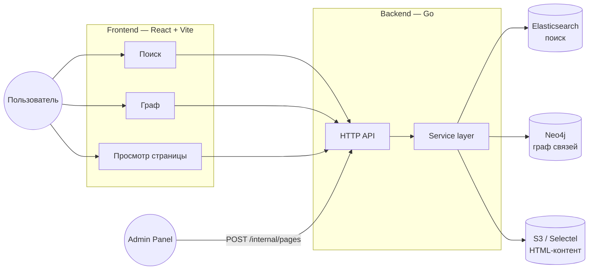
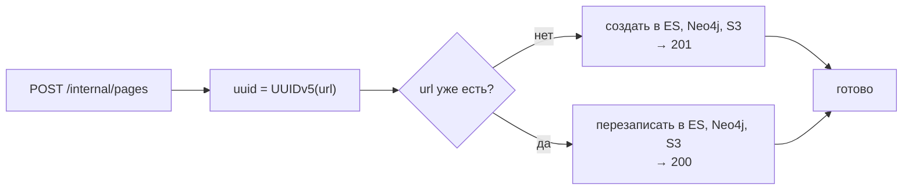

# WikiGraph  (demo)

Википедия со связями между страницами: поиск через Elasticsearch, граф — в
Neo4j, HTML-контент — в S3. Все три хранилища связаны через `uuid`,
детерминированный от `url`.

# Зачем нужен проект
- Для развития как DevOps инженер
- Расширить свой стек
- Научиться строить инфру

# Запуск
Nginx пока что слушает на 80 http, админ 8000
```bash
sudo docker compose up -d   # в корне
```

## Архитектура


---

Идемпотентность вставки:


---

# Что дальше

- в будущем будет создан CI/CD пайплайн
- Улучшу IaC часть
- Добавлю нагрузочное тестирование
- Внедрение sec
- Доведу проект до production-ready + подробная документация
